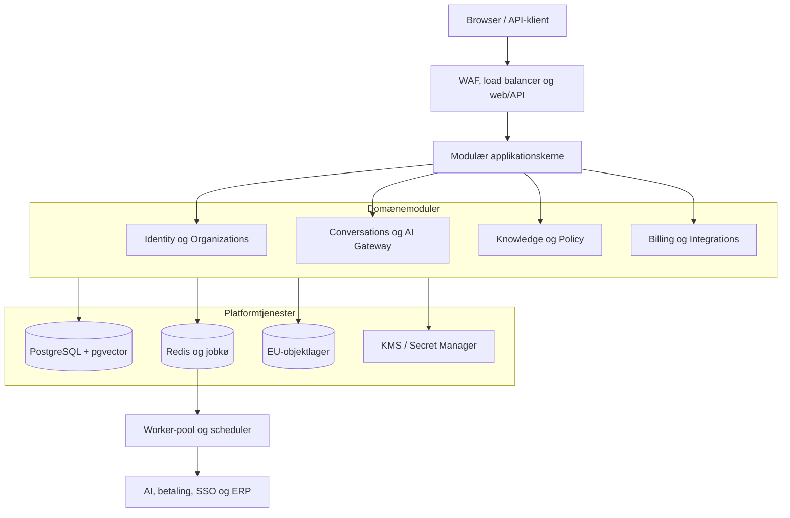
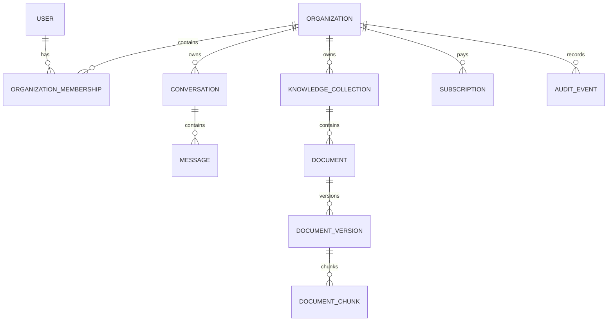
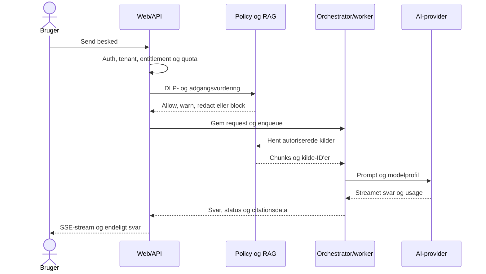
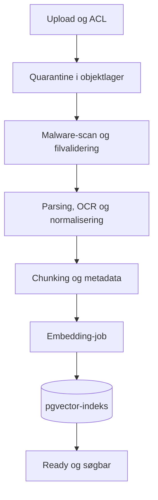
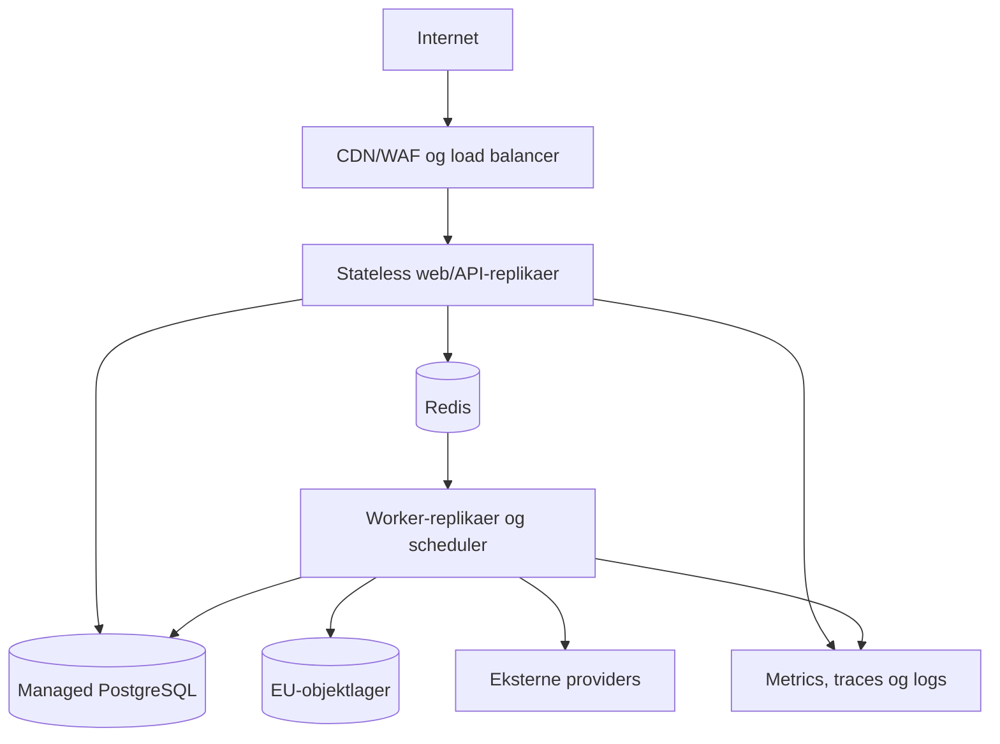

# SaaS-systemarkitektur for EiraMultiChat

**Status:** Anbefalet målarkitektur og migrationsplan, revision 1.3  
**Dato:** 18. august 2026  
**Grundlag:** Nuværende kode i `smoeberg/aimultichat`, branch `agent/harden-audit-findings`, samt produktoplægget i `Indsat markdown.md`.

**Revision 1.3:** Den systemansvarliges 15-minutters rejse er fastlagt som North Star med målbare acceptkriterier. Pilot-RAG understøtter tekstbaseret PDF og DOCX, onboarding får et hårdt begrænset managed AI-forbrug, invitation af 40 medarbejdere er et eksplicit krav, og governance-rapporten er defineret som evidens frem for en automatisk compliance-erklæring. Det efterfølgende arkitekturreview er disponeret eksplicit: performance måles før Octane, clustering, partitionering eller ekstern vektordatabase indføres.

## 1. Ledelsesresumé

EiraMultiChat bør udvikles fra den nuværende single-installation til en **multi-tenant modulær monolit**. Det er den bedste balance mellem hastighed, driftsrisiko og fremtidig skalerbarhed. Der er endnu ikke et trafik- eller teambehov, som kan retfærdiggøre mikroservices, men domænerne skal adskilles tydeligt, så udvalgte dele senere kan udskilles.

Den anbefalede tekniske retning er:

- **Laravel 13 på PHP 8.3+** som applikationsramme, server-renderet UI og et versioneret API.
- **PostgreSQL med Row-Level Security (RLS) og pgvector** som samlet system of record og vektorlager.
- **Redis** til køer, rate limits, korte låse, cache og idempotens.
- **S3-kompatibelt objektlager i EU** til dokumenter, eksportfiler og revisionsarkiver.
- **Tenant-isolation i tre lag:** applikationskontrol, database-RLS og automatiske isolationstests.
- **BYOK som normal driftsmodel** kombineret med et lille, hårdt begrænset managed onboardingforbrug, så første værdi ikke kræver, at kunden allerede har en API-nøgle.
- **Knowledge/RAG, DLP, billing og ERP som separate domænemoduler**, ikke som ekstra logik i den eksisterende chat-controller.
- **Trinvis strangler-migrering**, så eksisterende provider-adaptere og sikkerhedsarbejde bevares, mens UI og funktioner flyttes modul for modul.

Et realistisk mål er en differentieret pilot med organisationer, roller, BYOK, chat, modelskift, one-click krydsverificering, Lightweight RAG og billing på cirka **12–16 uger med 2–3 erfarne udviklere**. Fuld RAG, DLP, SSO og ERP følger i kontrollerede faser. Produktoplæggets samlede enterprise-scope er fortsat for stort til én stabil 0–3-måneders leverance.

### 1.1 North Star: fra systemansvarlig til dokumenteret første værdi på under 15 minutter

Eira sælger ikke blot adgang til en chat. Produktets kerneoplevelse er, at en systemansvarlig hurtigt kan give medarbejdere sikker adgang til virksomhedens viden og samtidig vise ledelse og DPO, hvordan brugen styres.

**North Star-målet er:**

> En ny kunde skal kunne gå fra gennemført checkout til første autoriserede svar med en verificerbar dokumenthenvisning, udsendte medarbejderinvitationer og en tilgængelig governance-status på under 15 minutter—uden teknisk assistance.

| Trin | Brugeroplevelse | Systemkrav | Målbar accept |
|---|---|---|---|
| 1. Konto og betaling | Vælg plan, indtast firma og betal | Idempotent checkout, automatisk organisation, abonnement og entitlements | Aktiveret tenant højst 30 sekunder efter godkendt betaling |
| 2. Vidensmapper | Opret “Personalehåndbog” og “Salg”, upload PDF/DOCX | Guided wizard, pre-signed upload, scan, parsing, chunking og embeddings | P95 ready-to-query under 3 minutter for pilotens dokumentgrænse |
| 3. Inviter 40 medarbejdere | Indsæt/CSV-upload e-mails eller brug kontrolleret link, tildel rolle/gruppe | Bulk-invite, preview, deduplikering, udløb, domænebegrænsning og audit | 40 invitationer valideret og queued på under 2 minutter uden dubletter |
| 4. Første medarbejderværdi | Stil spørgsmål, se direkte kilde, verificér med en anden model | ACL-filtreret retrieval, citationsdata, modelskift og verifikationsrelation | Første svar viser gyldig dokument-, side- og chunkreference |
| 5. Ledelsesrygdækning | Eksportér governance-rapport | Model-/use-case-inventory, policyversioner, usage, audit og datahåndteringsstatus | Første rapport genereret på under 60 sekunder med tydelig evidensperiode og forbehold |

De 15 minutter måles fra bekræftet betaling til trin 2–5 er teknisk tilgængelige. Medarbejdernes accept af invitationer ligger uden for målet, men invitationerne skal være afsendt eller queued. Målet måles løbende som median, P90 og fejlrate; produktteamet optimerer efter **time to first governed answer**, ikke blot signup-konvertering.

### 1.2 Køber, bruger og bevismodtager

| Aktør | Det, de reelt køber | Produktets bevis |
|---|---|---|
| Systemansvarlig | Kontrol, hurtig udrulning og færre manuelle spørgsmål | Onboardingstatus, adgangsregler, modeloversigt og audit |
| Medarbejder | Et enkelt svar fra virksomhedens egen viden | Kildehenvisning og mulighed for modelkrydstjek |
| Direktør | Overblik over anvendelse, risiko og ansvar | Ledelsesegnet governance-rapport |
| DPO/compliance | Dokumentation for dataflows, policies og retention | Eksporterbart evidensgrundlag med periode, scope og forbehold |

### 1.3 Kundeløfter, der kan dokumenteres

Tre formuleringer skal være præcise i salgsmateriale og UI:

| Undgå absolut formulering | Dokumenterbart Eira-løfte |
|---|---|
| “100 % datasikkerhed” | “Data er tenant-isoleret, krypteret, adgangsstyret og løbende testet mod cross-tenant adgang.” |
| “Jeres data bliver aldrig brugt til modeltræning” | “Eira træner ikke egne modeller på kundedata. For eksterne AI-providers vises og håndhæves den godkendte providerprofil, databehandleraftale og aktuelle retention-/træningsvilkår.” |
| “Rapporten beviser, at I overholder EU AI Act” | “Rapporten samler governance-evidens, kontrolstatus og afvigelser til virksomhedens egen juridiske og organisatoriske vurdering.” |

Rapporten er dermed rygdækning og revisionsspor—ikke en certificering eller juridisk garanti.

## 2. Nuværende system og vigtigste arkitekturgab

### 2.1 Det, der allerede er værd at bevare

Den nuværende kode er et brugbart produktfundament og indeholder allerede flere gode egenskaber:

- Provider-adaptere for OpenAI-kompatible API'er, Anthropic og GPAI.
- Hærdet autentifikation, sessioner, CSRF-beskyttelse og adgangskontrol.
- Kryptering af hemmeligheder og chats med versioneret AES-GCM-format.
- Udgående host-allowlist og SSRF-beskyttelse.
- Ejerskabskontrol på samtaler og server-side grænser for input.
- Migrationsværktøj, oprydningsjob, CI og integrationstest mod MySQL.
- Sletning og retention af chatdata.

### 2.2 Begrænsninger i den nuværende kode

| Område | Nuværende løsning | SaaS-gap | Anbefalet ændring |
|---|---|---|---|
| Tenancy | Én installation; `users`, `conversations`, `bots` og `app_settings` er globale | Ingen organisationer eller tenant-isolation | `organizations`, medlemskaber, `organization_id` på alle tenantdata og PostgreSQL RLS |
| Roller | Global `admin/user`-rolle | En bruger kan ikke have forskellige roller i forskellige organisationer | Organisationsbaseret RBAC med `owner`, `admin`, `member`, `auditor`, `billing_admin` |
| Chat-flow | Synkront provider-kald i web-requesten | Lange requests, svær retry/idempotens og begrænset skalering | `ChatOrchestrator`, køjob og SSE-streaming |
| Administration | Stor, samlet `public/admin.php` | Svær at teste og udvide sikkert | Modulære admin-use-cases og policies |
| Konfiguration | Global key/value-indstilling | Hemmeligheder og features kan ikke variere per tenant | Tenant-konfiguration, entitlements og envelope encryption |
| Rate limiting | MySQL fixed-window-tæller | Belastning på primær database og begrænset distributed control | Redis token bucket/sliding window samt planbaserede kvoter |
| GitHub | Global token og allowlist | Ikke tenant-isoleret; ét credential scope | Tenant-scoped integrationsforbindelser og mindst mulige OAuth-scopes |
| Dokumentviden | Ikke implementeret | Ingen ingestion, ACL, embeddings eller kilder | Knowledge/RAG-modul, objektlager, køpipeline og pgvector |
| Billing | Ikke implementeret | Ingen abonnementstilstand, entitlements eller usage ledger | Billing-abstraktion, webhook inbox, reconciliation og entitlements |
| Audit/DLP | Ikke implementeret | Ingen policy-afgørelser eller dokumenterbar kontrol | Policy engine, append-only auditmetadata og retention |
| Drift | Én PHP-applikation og database | Ingen separat worker, SLO, restore-test eller observability-model | Stateless web-pool, workers, scheduler, metrics/traces og backupøvelser |

### 2.3 Konklusion på kodegennemgangen

Den eksisterende løsning skal **ikke** blot have tilføjet en `tenant_id` i enkelte tabeller. Tenancy påvirker identitet, queries, køjobs, filadgang, cache keys, rate limits, AI-credentials, billing, audit og alle integrationer. Det skal indføres som et gennemgående sikkerhedsprincip.

Den eksisterende håndbyggede MVC-struktur er acceptabel til den nuværende størrelse, men vil gøre SaaS-udvidelsen dyr og fejlbehæftet. En trinvis overgang til Laravel giver standardiserede migrations, policies, queues, events, validering, testværktøjer og dependency injection. Laravel 13 kræver PHP 8.3 og har planlagt security support til marts 2028; se [Laravel 13 release notes](https://laravel.com/docs/13.x/releases).

## 3. Arkitekturprincipper

1. **Tenant er en sikkerhedsgrænse.** Ingen tenant-query må kunne udføres uden en valideret organisationskontekst.
2. **Default deny.** Ressourceadgang, RAG-samlinger, integrationer og administrative handlinger kræver eksplicit tilladelse.
3. **Modulær monolit før mikroservices.** Domæner har klare contracts og events, men deployes samlet, indtil belastning eller teamstruktur dokumenterer et splitbehov.
4. **Asynkront ved langsomt eller fejludsat arbejde.** AI-kald, ingestion, embeddings, rapporter, billing-reconciliation og ERP-synkronisering udføres af idempotente jobs.
5. **Provider-uafhængig kerne.** AI-, betalings-, lager- og integrationsleverandører ligger bag interfaces.
6. **Privacy by design.** Minimer data, krypter indhold, brug korte standard-retentioner og undgå prompts i almindelige logs.
7. **Audit er bevis, ikke markedsføringsetiket.** Systemet skal skabe sporbar dokumentation, men må ikke automatisk kaldes “GDPR-” eller “AI Act-compliant”.
8. **API-first domænelogik.** Web-UI og `/api/v1` anvender de samme application services og policies.
9. **Sikker migrering.** Hver fase har datareconciliation, rollback-plan og automatiske isolationstests.
10. **Profilér før skaleringsteknologi.** Octane, Redis Cluster, databasepartitionering og separat vektordatabase kræver et målt problem og en accepteret ADR.
11. **Pakker er implementation, ikke arkitektur.** Tenancy-, modules- og adminpakker indføres kun efter security-, maintenance- og exit-review; modulgrænser og RLS må ikke afhænge af en tredjepartspakke.

## 4. Målarkitektur

### 4.1 Domænemoduler

| Modul | Ansvar | Vigtigste interfaces/events |
|---|---|---|
| Identity | Login, MFA, OIDC, sessions, auth identities | `IdentityProvider`, `UserAuthenticated` |
| Organizations | Organisationer, medlemskaber, invitationer, grupper, RBAC | `TenantContext`, `MembershipChanged` |
| Conversations | Samtaler, beskeder, deling, retention | `ConversationService`, `MessageCreated` |
| AI Gateway | Modelprofiler, provider-routing, retries, streaming, tokenmåling | `AiProvider`, `AiRequestCompleted` |
| Knowledge | Upload, parsing, chunking, embeddings, søgning og citationskilder | `EmbeddingProvider`, `DocumentIndexed` |
| Policy & Compliance | DLP, risikoklassifikation, audit, eksport, retention | `PolicyDecision`, `AuditEventRecorded` |
| Billing & Entitlements | Planer, abonnementer, usage ledger, kvoter og webhooks | `BillingProvider`, `EntitlementChanged` |
| Integrations | GitHub, e-conomic, Uniconta og fremtidige connectors | `ToolConnector`, `ToolExecutionCompleted` |
| Reporting | Forbrug, omkostning, aktivitets- og compliance-rapporter | Read models og eksportjobs |
| Platform Operations | Platformadministration, feature flags, support og break-glass | Særskilt platformrolle og audit |

Moduler må ikke læse direkte i hinandens tabeller fra controllers. De samarbejder gennem application services, read models og domæneevents. I samme deployment kan events først være transaktionelle outbox-events; en ekstern eventbus er ikke nødvendig i første version.

### 4.2 Mapping fra nuværende kode

| Nuværende komponent | Fremtidigt hjem | Migrationsstrategi |
|---|---|---|
| `bootstrap.php`, `AuthController`, `User` | Identity + Organizations | Flyt login først; tilføj medlemskab og tenant-switch |
| `ApiController`, `Chat`, `Message` | Conversations + ChatOrchestrator | Bevar API-adfærd, men flyt provider-kald til use-case/job |
| `Bot`, `BotService`, `HttpJsonClient` | AI Gateway | Bevar adapterlogik bag `AiProvider`-interface |
| `GitHubService` | Integrations | Gør credentials og allowlist tenant-scoped |
| `SettingsService`, `Security` | Tenant Config + Secret Vault | Migrer fra global nøgle til envelope encryption |
| `RateLimiter` | Platform/Entitlements | Flyt tællere til Redis og registrer usage i ledger |
| `public/admin.php` | Organization Admin + Platform Admin | Opdel i policies og use-cases; adskil operator fra tenantadmin |
| `bin/migrate.php`, cleanup-jobs | Framework migrations + scheduler | Bevar funktionalitet, standardiser execution og metrics |

### 4.3 Onboarding Orchestrator

15-minutters-rejsen må ikke implementeres som én lang controller eller distribueret transaktion. En `OnboardingOrchestrator` styrer en resumérbar state machine:

`checkout_confirmed → tenant_activated → knowledge_ready → invites_queued → first_answer → governance_ready`

- Hvert checkpoint er idempotent og har timestamp, status, fejlårsag og retry-mulighed.
- Betaling, dokumentingestion, invitationer og rapportgenerering kommunikerer via outbox/events.
- UI viser konkret fremdrift og lader kunden fortsætte med næste trin, mens jobs arbejder.
- En fejl i eksempelvis invitationer ruller ikke betaling eller færdigindekserede dokumenter tilbage.
- Produktanalytics registrerer anonymiserede tider mellem checkpoints, så P50/P90 time-to-value kan følges.
- Support kan se status og correlation-ID, men ikke dokument- eller promptindhold.

## 5. Tenant- og identitetsarkitektur

### 5.1 Tenantmodel

- `users` er globale identiteter, identificeret ved normaliseret, unik e-mail eller ekstern subject-ID.
- `organizations` er tenants og ejer alle forretningsdata.
- `organization_memberships` er many-to-many og bærer rolle og status.
- En bruger vælger aktiv organisation efter login. Serveren udleder tenantkonteksten fra session/token og et aktivt medlemskab—aldrig fra et frit klientfelt.
- Platformoperatører håndteres i en separat `platform_admin_assignments`-model med MFA, tidsbegrænset adgang og fuld audit. De er ikke almindelige tenantadmins.
- E-mailinvitationer er engangstokens, hashes i databasen, udløber og er bundet til organisation, e-mail og ønsket rolle.
- Bulk-invite understøtter preview, normalisering, deduplikering og CSV med højst et planbaseret antal modtagere per batch.
- Delbare invitationslinks udløber, har et maksimalt antal anvendelser, tildeler kun en forudvalgt basisrolle og kan begrænses til verificerede virksomhedsdomæner. Mappeadgang tildeles separat via grupper/ACL.
- Alle invitationer rate-limites og auditeres; re-send genbruger ikke et tidligere råt token.

### 5.2 RBAC og ressourceadgang

| Rolle | Standardrettigheder |
|---|---|
| `owner` | Organisation, abonnement, medlemmer, SSO og sletning |
| `admin` | Medlemmer, grupper, AI-profiler, knowledge og policies |
| `member` | Chat og tildelte knowledge-samlinger/integrationer |
| `auditor` | Read-only audit, rapporter og policyafgørelser |
| `billing_admin` | Abonnement, fakturering, budget og usage; ikke chatindhold |

RBAC suppleres med ressource-ACL for grupper og knowledge-samlinger. Et medlems rolle giver aldrig automatisk adgang til alle dokumenter.

### 5.3 Database isolation

Alle tenant-ejede tabeller får:

- `organization_id UUID NOT NULL`.
- Sammensatte foreign keys og unikke constraints, så relaterede rækker ikke kan krydse tenantgrænsen.
- Indeks, der starter med `organization_id` for de almindelige access paths.
- PostgreSQL RLS-policy for `SELECT`, `INSERT`, `UPDATE` og `DELETE`.
- `FORCE ROW LEVEL SECURITY`, hvor det er relevant.

Applikationen sætter tenantkonteksten transaktionelt, eksempelvis `SET LOCAL app.current_organization_id = ...`. Runtime-databaserollen må hverken eje tabellerne eller have `BYPASSRLS`, fordi tabel-ejere og privilegerede roller ellers kan omgå policies. PostgreSQLs officielle dokumentation beskriver netop denne adfærd: [Row Security Policies](https://www.postgresql.org/docs/current/ddl-rowsecurity.html).

RLS er defense-in-depth, ikke erstatning for application policies. Hvert request og job skal stadig autorisere bruger, organisation og ressource.

### 5.4 Køjobs og cache

- Alle jobs bærer `organization_id`, actor-ID og correlation-ID.
- Worker etablerer tenantkontekst på ny og genautoriserer ressourceadgang.
- Cache keys har obligatorisk tenantprefix.
- Jobs er idempotente med en unik business key, ikke kun queue-job-ID.
- Ingen serialiserede ORM-objekter fra én tenant må genbruges efter kontekstskifte.

## 6. Logisk datamodel

### 6.1 Centrale tabeller

| Domæne | Tabeller |
|---|---|
| Identity/tenant | `users`, `auth_identities`, `organizations`, `organization_memberships`, `invitations`, `groups`, `group_memberships`, `sso_connections` |
| Billing | `plans`, `subscriptions`, `entitlements`, `billing_events`, `webhook_events`, `usage_events` |
| AI/chat | `provider_credentials`, `provider_policy_snapshots`, `model_profiles`, `conversations`, `messages`, `ai_requests`, `ai_request_relations`, `ai_response_sources` |
| Knowledge | `knowledge_collections`, `collection_access`, `documents`, `document_versions`, `document_chunks`, `embedding_models` |
| Governance | `dlp_policies`, `policy_decisions`, `audit_events`, `retention_policies`, `governance_reports`, `governance_control_results`, `export_jobs` |
| Integration | `integration_connections`, `tool_definitions`, `tool_executions`, `outbox_events` |

Vigtige modelleringsregler:

- Penge gemmes som integer minor units plus ISO-valutakode; aldrig som float.
- Tidsstempler gemmes i UTC.
- Beskedindhold og credentials gemmes krypteret med `key_version`.
- `usage_events` er append-only og indeholder provider, model, input/output tokens, estimeret omkostning, request-ID og kilde.
- `ai_request_relations` forbinder eksempelvis en verifikationsanmodning med det præcise, immutable svar-snapshot, den vurderer.
- En embedding-model/version og dimension er eksplicit metadata. Vektorer med forskellige dimensioner blandes ikke i samme indeks.
- Soft delete bruges kun, hvor forretningsmæssig gendannelse kræves. Et særskilt purge-job udfører faktisk sletning efter retentionperioden.

## 7. Chat- og AI-arkitektur

### 7.1 Requestflow

Flowet består af følgende atomare trin:

1. Validér session/token, aktivt medlemskab, feature entitlement, budget og rate limit.
2. Normalisér input og kør DLP/use-case-policy med afgørelsen `allow`, `warn`, `redact` eller `block`.
3. Gem brugerbesked, `ai_request` og outbox-event i samme databasetransaktion.
4. Worker henter kun chunks, brugeren må se, og bygger en prompt med tydelig adskillelse mellem systeminstruktion og ubetroet dokumentdata.
5. AI Gateway vælger provider/model, anvender timeout, retry med jitter, circuit breaker og idempotens.
6. Svaret streames til klienten via SSE, mens den kanoniske tilstand gemmes server-side.
7. Gem svar, usage, policyafgørelse, modelversion, kilde-ID'er og auditmetadata.
8. Frigiv en sekvenslås per samtale, så samtidige beskeder ikke ændrer kontekstrækkefølgen.

### 7.2 Providerdesign

`AiProvider` bør have ensartede operationer for chat/stream, embeddings, token usage og capability discovery. Provider-fejl oversættes til interne fejlkoder, så UI og jobs ikke bliver leverandørspecifikke.

Credentials er tenant-ejede og kan være:

- **BYOK:** Tenantens egen nøgle; anbefalet ved lancering.
- **Managed:** Platformens nøgle med forbrugsbudget og økonomisk ansvar; indføres senere.

Modelprofiler styrer provider, model, temperatur, max tokens, systempolitik, knowledge-samlinger og tilladte tools. Brugeren vælger en profil—ikke vilkårlige providerparametre.

### 7.3 Cross-model verification

Den nuværende mulighed for at skifte model/provider bevares direkte i fase 1. Oven på den bygges en enkel **“Verificér med en anden model”**-handling. Det er en relativt billig differentiering, fordi den eksisterende provider-adapterstruktur genbruges.

Verifikation er en ny AI-anmodning, ikke en ændring af det oprindelige svar. Brugeren vælger en anden tilladt modelprofil, eller organisationens admin fastsætter en standard-verifikationsprofil. Systemet skal gemme:

- Hash og snapshot-ID for det svar, der verificeres.
- Reference fra verifikationen til den oprindelige `ai_request` via `ai_request_relations`.
- Verifikationsmodel og policyversion.
- Struktureret resultat: `supported`, `partially_supported`, `unsupported`, usikkerhed og begrundelser.
- Egne usage- og omkostningsposter.

Det oprindelige svar må ikke overskrives. Verifikationsresultatet vises som et separat lag med modelnavn, tidspunkt og eventuelle uenigheder. Funktionen bør markedsføres som en ekstra kvalitetskontrol, ikke som garanti for faktuel korrekthed.

## 8. Knowledge/RAG

Knowledge/RAG leveres i to produkttrin. Pilotens Lightweight RAG skal være lille nok til at nå markedet hurtigt, men må ikke springe tenant- og adgangssikkerhed over.

| Egenskab | Lightweight RAG i fase 2 | Fuld RAG i fase 3 |
|---|---|---|
| Formater | Tekstbaseret PDF og DOCX uden OCR | PDF, DOCX, TXT, MD, CSV og OCR |
| Kapacitet | Højst 1–2 dokumenter per vidensmappe med en konservativ filgrænse | Planbaserede dokument- og lagerkvoter |
| Retrieval | Vector top-k i pgvector | Hybrid search, reranking og diversitet |
| ACL | Tenant + eksplicit mappeadgang | Grupper, afdelinger og avancerede resource policies |
| Ingestion | Scan, tekstudtræk, chunking og én embedding-model | Versionspipeline, OCR, re-embedding og flere parsere |
| Kilder | Dokument, side og chunk-reference | Udvidede citationer, previews og evals |
| Drift | Én idempotent ingestion queue | Prioriterede queues, reprocessing og detaljeret observability |

Lightweight betyder dermed begrænset format og volumen—ikke svag isolation. Upload, malware-scan, tenantfilter, mappe-ACL, citationsdata og fuld afledt sletning er obligatoriske allerede i piloten. Tekstbaseret DOCX er en del af pilotmålet, fordi kunderejsen ellers ikke matcher almindelige personalehåndbøger og politikdokumenter.

### 8.1 Ingestionpipeline

- Upload bruger pre-signed URL, filstørrelsesgrænse, MIME-sniffing og checksum.
- Dokumentet er utilgængeligt, indtil scanning og parsing er gennemført.
- Hver upload skaber en immutable `document_version`; jobs er idempotente på version og content hash.
- Parseren gemmer side, afsnit, overskrift og tegnposition, så en citation kan føres tilbage til kilden.
- Chunkstørrelse konfigureres per dokumenttype. 500–1.000 tokens med overlap er et startpunkt, ikke en universel regel.
- Første version bruger én embedding-model og dimension. Modelskift sker via parallel re-embedding og atomisk indeksaktivering.
- pgvector tilbyder exact nearest-neighbor search som standard samt HNSW og IVFFlat til approximate search; HNSW giver typisk en bedre speed/recall-tradeoff på bekostning af byggetid og hukommelse. Se [pgvector-projektets dokumentation](https://github.com/pgvector/pgvector).

### 8.2 Retrieval og ACL

Søgningen filtrerer i databasen på `organization_id`, dokumentstatus, collection-ACL og brugerens gruppe-ID'er **før** resultater bruges. Overfetch-og-filtrér i applikationen er ikke tilstrækkeligt, fordi det kan lække scores eller metadata.

Anbefalet retrieval:

1. Hybrid søgning: PostgreSQL full-text + vector similarity.
2. Tenant- og ACL-filter i samme query.
3. Reranking af et lille kandidatset.
4. Top-k chunks med diversitet på dokument og sektion.
5. Validerede kildehandles, eksempelvis `S1`, som modellen må referere til.
6. UI-citation bygges fra `ai_response_sources`, ikke fra modelgenererede URL'er.

Dokumentindhold behandles som ubetroet data. Instruktioner i dokumenter må ikke ændre systempolitik, aktivere tools eller udvide adgang.

### 8.3 Sletning og retention

Sletning af et dokument markerer det straks utilgængeligt, hvorefter et purge-job fjerner objekt, tekst, chunks, embeddings og cache. Organisationens sletning har en kontrolleret grace period og en dokumenteret purge workflow. Faktura- og transaktionsdata kan kræve en anden juridisk retention end chatindhold.

### 8.4 Scale gate for pgvector

`100.000 embeddings` er ikke i sig selv en arkitekturgrænse. Dimension, HNSW-parametre, tenantfilterets selektivitet, top-k, recallkrav, hukommelse og samtidighed afgør resultatet. pgvector er derfor baseline, og der køres reproducerbare benchmarks ved repræsentative fordelinger omkring 100.000, 1 million og 5 millioner chunks.

Benchmarken måler:

- P50/P95/P99 latency med tenant- og ACL-filter.
- Recall@k mod et exact-search gold set.
- Indeksbyggetid, indeksstørrelse, memory pressure og write-amplification.
- Samtidige retrievals under ingestion og almindelig transaktionel belastning.
- Resultatantal ved selektive filtre og pgvectors iterative index scans.

Foreløbig exit-gate er, at pgvector efter dokumenteret tuning ikke kan holde aftalt retrieval-SLO, foreløbigt P95 under 250 ms og Recall@10 på mindst 0,85 på produktets evals, uden at skade den transaktionelle database. Først da vurderes en særskilt vector service; **Qdrant er første kandidat, mens ChromaDB ikke er produktionsbaseline**. Tenant- og ACL-kontrollen skal i så fald bevares i retrievaldesignet og testes på ny.

pgvectors egne docs beskriver, at approximate indexes og filtre kræver særlig opmærksomhed, og at iterative scans kan udvide søgningen, indtil tilstrækkelige filtrerede resultater er fundet: [pgvector](https://github.com/pgvector/pgvector).

## 9. DLP, audit og compliance-evidens

### 9.1 Policy engine

Policy engine kombinerer deterministiske detektorer og, hvor passende, klassifikation:

- CPR- og andre nationale identifikatorer.
- API-nøgler, tokens og passwords.
- Persondata og følsomme kategorier.
- Kunde-definerede termer og regulære udtryk.
- Use-case-klasser, eksempelvis HR, juridisk, kundeservice eller intern udvikling.

En policyversion giver en afgørelse med matchtyper, confidence, handling og eventuel brugerbegrundelse. Overrides kræver særskilt rettighed og audit.

Piloten indeholder **DLP Guardrails Lite** med deterministisk detektion af oplagte API-nøgler/secrets og validerbare CPR-formater samt `warn`/`block`. Fuld persondataklassifikation, tenantkonfigurerede regelsæt, afdelingspolitikker og AI-baseret klassifikation forbliver fase 4. Det gør det muligt at demonstrere reel kontrol tidligt uden at love en komplet DLP-løsning.

### 9.2 Auditdesign

Auditloggen bør som standard indeholde:

- Organisation, actor, handling, ressource-ID og tidspunkt.
- Request/correlation-ID, policy- og modelversion.
- Resultat, fejlkode, tokenforbrug og content hash.
- Om adgang blev tilladt, advaret, redigeret eller blokeret.

Fuld prompt og fuldt svar skal **ikke** være immutable auditindhold som standard. Det kolliderer med dataminimering, storage limitation og sletning. EU-Kommissionens GDPR-vejledning fremhæver formålsbegrænsning, dataminimering og opbevaring kun så længe nødvendigt: [GDPR principles](https://commission.europa.eu/law/law-topic/data-protection/information-business-and-organisations/principles-gdpr_en).

Hvis en tenant vælger content capture, skal den være eksplicit, krypteret, rollebeskyttet og have egen kort retention. Auditmetadata gemmes i en append-only tabel via en insert-only rolle. Daglige hash-seals og signerede eksportfiler i objektlager gør efterfølgende ændringer detekterbare.

EU AI Act trådte i kraft 1. august 2024 og har trinvise anvendelsesdatoer. Kontroller og rapporter skal derfor knyttes til konkrete use cases og risikoklasser, ikke en generel “AI Act compliant”-etiket. Se [EU-Kommissionens AI Act-overblik](https://digital-strategy.ec.europa.eu/en/policies/regulatory-framework-ai). Juridisk klassifikation og retention skal valideres af rådgiver og databeskyttelsesansvarlig.

### 9.3 EU AI Act governance-rapport

Dashboardhandlingen bør hedde **“Eksportér AI-governance-rapport”**. En undertitel kan forklare, at rapporten samler EU AI Act-relevant evidens. Dette undgår, at en teknisk eksport fremstår som en juridisk certificering.

Rapporten indeholder som minimum:

- Organisation, rapportperiode, genereringstidspunkt, schema- og rapportversion.
- Inventory over aktiverede providers, modeller, modelprofiler og gældende databehandlings-/retentionsprofil.
- Aggregeret brug per afdeling/use case uden rå prompts som standard.
- Knowledge-samlinger, adgangsmodel, dokumenttyper og seneste purge-/retentionstatus.
- Policyversioner, DLP-afgørelser, overrides, hændelser og uafklarede afvigelser.
- Rolle- og gruppeoversigt samt ændringer i privilegeret adgang.
- AI-literacy/træningsstatus, hvis organisationen vælger at registrere dette i Eira.
- Kontrolstatus med `implemented`, `partially_implemented`, `not_configured` eller `not_applicable` og link til underliggende audit-ID'er.
- Tydeligt scope, forbehold og tekst om, at rapporten er et evidensgrundlag, ikke juridisk rådgivning eller certificering.

Eksporten produceres som en læsbar PDF med en maskinlæsbar JSON/CSV-bilagsfil, får checksum/signaturmetadata og gemmes med tenantens retentionpolitik. En ny kunde kan straks generere en **konfigurationsrapport**; en historisk anvendelsesrapport bliver først meningsfuld, når rapportperioden indeholder faktisk aktivitet.

## 10. Billing, planer og entitlements

### 10.1 Adskil produktret fra betalingsleverandør

Produktet må ikke spørge “er Revolut-betalingen aktiv?” ved hvert featurekald. Billing-modulet oversætter betalingshændelser til en intern subscription state og beregnede entitlements.

Eksempel på tilstande:

`trialing → active → past_due → grace_period → suspended → cancelled`

Entitlements dækker blandt andet sæder, knowledge-lager, månedlige AI-requests, RAG, DLP, SSO, ERP og audit-retention. De caches kort, men den autoritative tilstand ligger i PostgreSQL.

### 10.2 Providerabstraktion, Revolut og Stripe-fallback

`BillingProvider` implementerer checkout, betalingsmetode, recurring charge, refund, webhook-normalisering og statusopslag. **Revolut er den foretrukne produktionsadapter, mens Stripe er en eksplicit fallback til pilotfasen.** Entitlements, abonnementstilstande, fakturanumre og usage må aldrig være modelleret som leverandørspecifikke felter.

Begge adaptere skal bestå samme contract test suite. En organisation bindes til én billing-provider per aktivt abonnement, og et providerskift udføres som en kontrolleret migration—aldrig som et automatisk retry på tværs af providers.

Revoluts Merchant API kræver, at merchant-systemet selv implementerer recurring jobs, abonnementshåndtering og flere lifecycle-forpligtelser; se [Revolut subscription management](https://developer.revolut.com/docs/guides/merchant/optimise-checkout/save-payment-methods/subscription-management). Derfor kræves:

- Idempotency key på alle betalingsoperationer.
- Signed webhook inbox med rå body, event-ID, status og behandlingsforsøg.
- Verifikation af webhook-signatur og timestamp før parsing.
- Deduplicering og out-of-order-håndtering.
- Daglig reconciliation mellem intern subscription state og providerens data.
- Grace period, dunning og manuel supportworkflow.

Revolut beskriver HMAC-SHA256-signering og en timestamp-tolerance på fem minutter i [webhook verification-guiden](https://developer.revolut.com/docs/guides/merchant/monitor-and-observe/webhooks/verify-the-payload-signature). Implementationen skal også kunne håndtere nøgle-/signaturrotation.

Revolut-spiket tidsafgrænses til **fem arbejdsdage**, efter nødvendige sandbox-credentials er tilgængelige, tidligt i fase 2. Hvis teamet ikke inden da kan gennemføre sandbox-flowet for oprettelse, fornyelse, fejlende betaling, webhook-verifikation og reconciliation, aktiveres Stripe-adapteren til pilotkunder. Revolut-arbejdet fortsætter derefter uden at blokere lanceringen. Dunning-mails, grace periods og den interne subscription state machine forbliver platformens ansvar og deles af begge adaptere.

### 10.3 BYOK med hårdt begrænset onboardingforbrug

BYOK reducerer platformens variable omkostnings- og kreditrisiko, men et obligatorisk API-key-trin bryder 15-minutters-rejsen. Derfor får en ny, betalende organisation en lille `onboarding_managed_allowance`, som kun kan bruges til onboardingens første spørgsmål og modelverifikation.

- Allowancen har både request-, token-, tids- og beløbsgrænse og kan ikke genopfyldes af kunden.
- Usage reserveres atomisk før providerkald og reconciles efter svaret.
- Misbrug begrænses med verificeret betaling, rate limit, modelallowlist og én allowance per juridisk kunde/betalingsprofil.
- Når allowancen er opbrugt, skal kunden aktivere BYOK eller købe en plan med managed usage.
- UI viser tydeligt, hvilken provider behandler data, og hvilken data-/retentionsprofil der gælder.

Uanset model registreres usage. Fuld managed-token-drift kræver før lancering:

- Providerpriser som versionerede rate cards.
- Budgetter, hard caps og alarmer per organisation.
- Realtime usage reservation og endelig reconciliation.
- Håndtering af providerusage, der ankommer forsinket.
- Margin-, misbrugs- og betalingsrisikomodel.

## 11. Integrationer og værktøjskald

GitHub, e-conomic og Uniconta implementeres som connectors med tenant-scoped credentials. Et tool registry beskriver inputskema, required permission, data classification og om handlingen er read eller write.

Første ERP-version bør kun tillade få, read-only use cases, eksempelvis saldovisning eller fakturaopslag. Write-handlinger kræver:

- Eksplicit brugerbekræftelse med en menneskeligt læsbar preview.
- Fine-grained connector-scope og policykontrol.
- Idempotency key og audit af både request og providerrespons.
- Maksimal beløbs-/omfangsgrænse.
- Ingen eksekvering, blot fordi et RAG-dokument eller modelsvar indeholder en instruktion.

Webhook- og integrationshændelser går gennem en inbox/outbox-model. Dermed kan eksterne callbacks retries uden dobbelt effekt, og interne events publiceres først efter en committed transaktion.

## 12. Kryptering og secrets

Den nuværende ene globale `ENCRYPTION_KEY` bør erstattes af envelope encryption:

1. En separat data encryption key (DEK) per organisation og datatypeklasse.
2. DEK krypteres af en key encryption key i cloud KMS.
3. Ciphertext gemmer `key_id`, `key_version`, nonce og algoritme.
4. Credentials og content bruger separate nøgler.
5. Rotation re-wrapper DEK eller re-krypterer kontrolleret i baggrunden.

Secrets vises aldrig igen i fuld form efter oprettelse. De filtreres fra logs, exceptions, traces og supportværktøjer. Objektlager bruger både provider-side kryptering og applikationskryptering for særligt følsomme dokumenter.

## 13. Deployment og drift

### 13.1 Første produktionsprofil

- Én EU-region med mindst to web-replikaer på tværs af availability zones.
- PHP-FPM med OPcache er baseline. Laravel Octane/Swoole indføres kun efter profiling og en isolationstest, der beviser, at tenant-, request- og secret-state nulstilles korrekt mellem requests.
- Managed PostgreSQL med point-in-time recovery, kryptering og automatisk failover.
- Managed Redis med replication/persistence efter queue-SLO; Redis er ikke system of record.
- Separate worker queues: `chat-high`, `ingestion`, `billing`, `integrations`, `exports`.
- Scheduler som singleton/leader-electet proces.
- Feature flags styrer strangler-cutovers og kan slukke nye integrations- eller RAG-paths per tenant uden rollback af hele releasen.
- Objektlager har planbaserede kvoter, cost metrics og lifecycle-regler. Sletning skal også purge gamle objektversioner; versionering må ikke skabe skjult, uendelig retention.
- Infrastruktur som kode og identiske staging-/produktionsmønstre.
- Ingen produktionssecrets i repository eller `.env`-backupfiler.

PostgreSQL/outbox indeholder autoritativ job- og forretningstilstand, så et tabt Redis-job kan rekonstrueres. Redis understøtter både RDB snapshots og AOF, men persistencevalget har egne recovery-, latency- og omkostningstradeoffs og vælges ud fra RPO/RTO frem for som et generelt krav: [Redis persistence](https://redis.io/docs/latest/operate/oss_and_stack/management/persistence/).

Octane booter applikationen én gang og genbruger den mellem requests; Laravel dokumenterer derfor risikoen for stale request/container- og applikationsdefineret global state. Det gør “Octane fra dag ét” uhensigtsmæssigt i et tenantfølsomt system uden målinger og ekstra tests: [Laravel Octane](https://laravel.com/docs/13.x/octane).

### 13.2 Foreløbige SLO'er

| Mål | Pilot |
|---|---|
| Tilgængelighed for web/API | 99,9 % per måned |
| P95 platformlatency før AI first byte | < 500 ms, providerlatency ekskluderet |
| RPO | 15 minutter |
| RTO | 4 timer |
| Kritisk webhook-processing | 99 % inden 2 minutter |
| Tenant-isolationsfejl | 0 tolereret; release blocker |

Backup er først troværdig efter en automatiseret restore-test. Restore, tenant-export, tenant-purge og key rotation bør øves kvartalsvist.

### 13.3 Observability

- Strukturerede logs med correlation-ID og intern tenantreference, men uden prompts, dokumenttekst, tokens eller credentials.
- Metrics for requestlatency, providerfejl, token/cost, queue age, ingestionstatus, webhookfejl og DLP-afgørelser.
- Distributed traces fra webrequest til job/providerkald med redigerede attributter.
- Audit events opbevares separat fra driftslogs.
- Alarmer på budgetoverskridelse, voksende kø, fejlende reconciliation, restore-test og RLS-/authorization-test.

Laravel Horizon giver dashboard og metrics til Redis-baserede queues og jobfejl: [Laravel Horizon](https://laravel.com/docs/13.x/horizon).

## 14. Centrale Architecture Decision Records (ADR)

| ADR | Beslutning | Begrundelse | Revurderes når |
|---|---|---|---|
| 001 | Modulær monolit | Laveste koordinations- og driftsomkostning; klare modulgrænser | Et modul har selvstændig skalering, dataejerskab og team |
| 002 | Laravel 13 / PHP 8.3+ | Standardkomponenter for auth, policies, queues, events og tests | Supporthorisont eller dokumenteret performancekrav ændres |
| 003 | PostgreSQL + RLS | Databaseforsvar mod tenant-læk og stærke constraints | Kun ved regulatorisk krav om fysisk tenantdatabase |
| 004 | pgvector først | Én transaktionel platform og enkel ACL-filtering | Vektorskala/latency overstiger mål efter tuning |
| 005 | Redis-køer | Modent jobmønster, rate limit og korte locks | Durable eventstreaming bliver et dokumenteret krav |
| 006 | BYOK som drift, capped managed allowance til onboarding | Kombinerer lav økonomisk risiko med første værdi uden API-nøgle | Managed usage bliver et selvstændigt produkt |
| 007 | Revolut primær, Stripe fallback bag `BillingProvider` | Betalingsintegration må ikke blokere pilotlanceringen | Leverandørøkonomi eller markedskrav ændres |
| 008 | Envelope encryption per tenant | Blast-radius, rotation og sletning af nøgler | KMS/platformvalg ændres |
| 009 | Metadata-first audit | GDPR-dataminimering og anvendelig sporbarhed | Tenant har dokumenteret lovgrundlag for content capture |
| 010 | En EU-region først | Reducerer kompleksitet og giver klar dataplacering | Kundekrav eller SLO kræver flere regioner |
| 011 | Server-renderet UI + SSE | Hurtig levering, enkel auth og streaming | Offline-/meget kompleks klienttilstand kræver SPA |
| 012 | Outbox/inbox | Konsistens og idempotens uden distribuerede transaktioner | Eventplatform bliver nødvendig |
| 013 | 15 minutter til første governed answer | Kundeværdi og governance skal optimeres som ét sammenhængende flow | Målinger viser et andet dokumenteret købs-/aktiveringsmønster |
| 014 | PHP-FPM/OPcache før Octane | Undgår long-lived tenant-state uden dokumenteret performancebehov | Profiling viser en PHP-runtime-flaskehals, og isolationstests består |
| 015 | Ingen cluster/partition/vector-service i MVP | Minimerer drift og irreversible databeslutninger | Målte SLO-, størrelse- eller recoverygates overskrides efter tuning |

## 15. Trinvis migrations- og leveranceplan

### Fase 0 — Stabilt udgangspunkt (1–2 uger)

- Merge den hærdede kode efter review og grøn CI.
- Fjern gammel `env.txt`, roter alle tidligere eksponerede secrets og sanér Git-historik, hvis credentials har været committed.
- Aktivér branch protection, dependency scanning og secret scanning.
- Godkend ADR 001–015 og klassificér MVP-scope.
- Etabler Laravel/PHP 8.3, PostgreSQL og Redis i udvikling/CI uden at ændre produktion endnu.

**Gate:** Ingen kendte kritiske sikkerhedsfejl; secrets roteret; reproducerbar build og restore-plan.

### Fase 1 — SaaS-kernen (4–6 uger)

- Identity, organisationer, medlemskaber, invitationer og tenant-switch.
- PostgreSQL-schema, RLS og automatiske cross-tenant negative tests.
- Flyt chat, messages og provider-adaptere bag nye application services.
- Tenant-scoped BYOK og modelprofiler.
- Bevar det eksisterende modelskift og lever one-click krydsverificering med immutable svar-snapshots og separat usage.
- Simpel organisation-admin og platform-admin adskilt.
- Kontrolleret MySQL→PostgreSQL eksport/import med row counts, hashes og stikprøver.

**Gate:** To testtenants kan ikke læse, skrive, cache-hit'e eller queue-processere hinandens data; eksisterende chat- og modelskift består regressionstests; en verifikation kan spores til præcis original request og model.

### Fase 2 — Differentieret kommerciel pilot (5–7 uger)

- Planer, entitlements, subscription state machine og usage ledger.
- Fem arbejdsdages Revolut-spike samt Stripe-fallback bag samme `BillingProvider` contract tests.
- Valgt billing-adapter, signed webhook inbox, idempotens og daglig reconciliation.
- Onboarding Orchestrator, capped managed allowance, budgetter og rate limits.
- Tenant usage-dashboard og faktureringsadministration.
- Lightweight RAG: tekstbaseret PDF/DOCX, 1–2 dokumenter per mappe, pgvector top-k, tenant/mappe-ACL og validerede citationer.
- Minimal asynkron ingestion med malware-scan, idempotens og fuld purge af dokument og afledte chunks.
- Bulk-invite af mindst 40 medarbejdere via e-mail/CSV samt domænebegrænset invitationslink.
- DLP Guardrails Lite for oplagte secrets/API-nøgler og validerbare CPR-formater.
- Første governance-konfigurationsrapport med modeller, adgang, policies, datahåndteringsprofil og tydelige forbehold.

**Gate:** Webhook replay/out-of-order tests, refund/cancel/grace-period tests og økonomisk reconciliation uden dubletter; ingen retrieval fra uautoriserede tenants/mapper; pilotcitationer kan spores til korrekt PDF/DOCX-position; sletning fjerner alle afledte data; North Star-flowet gennemføres uden teknisk hjælp inden for de fastsatte P50/P90-mål.

### Fase 3 — Fuld Knowledge/RAG (4–7 uger)

- Udvid ingestion til TXT, MD, CSV, OCR og planbaserede lagerkvoter.
- Grupper/afdelinger, avanceret collection-ACL, hybrid retrieval, reranking og kildepreviews.
- Dokumentversionering, re-embedding, reprocessing og detaljeret observability.
- Prompt-injection-tests og RAG-evaluationsdatasæt.
- pgvector benchmark ved repræsentative skalaer og filtre; Qdrant-spike kun hvis exit-gaten udløses.

**Gate:** Ingen resultater fra uautoriserede collections; citationer kan spores til korrekt dokumentversion; parser- og retrieval-evals opfylder aftalte kvalitetsmål.

### Fase 4 — Governance og enterprise (4–6 uger)

- DLP-policy engine, audit export, retention og tenant-purge/export.
- Entra ID via OIDC; Google OIDC efter behov.
- MFA/break-glass for platformadministration.
- Versioneret AI-governance-rapport i PDF + maskinlæsbart bilag og dokumenterede kontroltests.

**Gate:** Policy false-positive/false-negative baseline, verificeret retention/purge, SSO account-linking tests, rapportgenerering under 60 sekunder for standardperioden og review af rapportens scope/forbehold ved DPO/juridisk rådgiver.

### Fase 5 — Udvidelser

- e-conomic og Uniconta, read-only først.
- Udvidede cross-model evals, automatiske verifikationspolicies og kvalitetsrapportering.
- Managed tokens med hard budgets og marginmodel.
- SCIM, SAML, dedikerede databaser eller flere regioner ved dokumenteret enterprisebehov.

## 16. Test- og release-strategi

Minimumskrav før hver release:

- Unit tests for policies, state machines, kryptering og prisberegning.
- Integrationstest mod rigtig PostgreSQL, Redis og objektlager-emulator.
- RLS-test med runtime-rollen, ikke kun databaseejeren.
- Property-/mutation-orienterede tests af tenant-ID, ACL og sammensatte foreign keys.
- Job replay, duplicate delivery og out-of-order tests.
- Provider contract tests med recorded/sanitized fixtures.
- End-to-end North Star-test for checkout→tenant→PDF/DOCX→40 invites→citeret svar→modelverifikation→governance-rapport.
- Security tests for IDOR, SSRF, prompt injection, uploadformat, webhook signature og secret leakage.
- RAG-evals for retrieval precision, citation fidelity og adgangsisolering.
- Load tests af SSE, queues, pgvector og rate limiting.
- Restore- og tenant-purge-test som release-/driftskontrol.

Schemaændringer følger expand/migrate/contract:

1. Tilføj bagudkompatibelt schema.
2. Deploy kode, der kan læse begge versioner.
3. Backfill idempotent og mål reconciliation.
4. Skift reads/writes.
5. Fjern gammelt schema i en senere release.

## 17. Risici og afværgning

| Risiko | Konsekvens | Afværgning |
|---|---|---|
| Tenant-læk via manglende filter | Kritisk databrud | RLS, composite constraints, policies og negative isolationstests |
| Big-bang rewrite | Lang featurepause og regressioner | Strangler-migrering og contract/regression tests |
| For stort MVP-scope | Forsinket og ustabil lancering | Lightweight RAG i piloten; fuld RAG, DLP og ERP efter klare fasegates |
| Leverandørlåsning | Dyre skift | Interfaces for AI, billing, storage og connectors |
| RAG prompt injection | Uønskede tools/dataeksponering | Dokumenter som ubetroet data, tool-policy og ingen implicit execution |
| Billing-dubletter | Kundetab og økonomisk fejl | Idempotens, webhook inbox og reconciliation |
| Revolut forsinker lancering | Pilot og omsætning udskydes | Tidsafgrænset spike, fælles contract tests og Stripe-fallback |
| Overlogging af persondata | GDPR-risiko | Metadata-first audit, redaction og korte retentioner |
| Global krypteringsnøgle | Stor blast-radius | Tenantbaseret envelope encryption i KMS |
| Managed tokens uden kontrol | Uforudsete omkostninger | Capped onboarding-allowance, BYOK som drift, hard budgets og usage reservation |
| Umodne ERP writes | Forretningsskade | Read-only først, confirmation og beløbsgrænser |
| For tidlig skaleringsteknologi | Mere drift, tenant-state-fejl og langsommere levering | PHP-FPM/OPcache og managed single services først; målte exit-gates før Octane/cluster/partitionering |

## 18. Disposition af det efterfølgende arkitekturreview

Reviewet bekræfter hovedretningen, men en række forslag er generelle skaleringsteknikker uden et påvist problem. De disponeres således:

| Reviewforslag | Beslutning | Hvad ændres |
|---|---|---|
| Laravel 13, PostgreSQL, Redis og objektlager | **Accepter** | Ingen ændring i grundstakken |
| “PHP er langsommere end Node/Go” | **Ingen arkitekturændring** | AI- og retrievallatency måles; runtime vælges ikke om på baggrund af generel benchmarkpåstand |
| Laravel Octane/Swoole fra start | **Udskyd** | PHP-FPM + OPcache er baseline; Octane kræver profiling og tenant-state isolationstest |
| Laravel Nova | **Udskyd/produktvalg** | Admin-UX og licens vurderes efter use cases; domænearkitekturen må ikke afhænge af Nova |
| `stancl/tenancy` eller Spatie Multitenancy | **Betinget af spike** | Eira beholder egen lille `TenantContext` + PostgreSQL RLS; en pakke må ikke skjule eller omgå RLS |
| `nWidart/laravel-modules` | **Ikke nødvendigt nu** | Composer namespaces, contracts og dependency tests er tilstrækkelige modulgrænser |
| pgvector-test ved større datasæt | **Accepter og skærp** | Reproducerbar 100K/1M/5M benchmark med tenantfiltre, latency, recall og write load |
| Skift til Qdrant/Chroma ved 100K embeddings | **Afvis fast tærskel** | Qdrant vurderes kun ved dokumenteret exit-gate; ChromaDB er ikke produktionsbaseline |
| Partitionér tabeller per `tenant_id` | **Udskyd** | Ingen MVP-partitionering; indeks/RLS/queries tunes først. Partitionering kræver egen ADR og migreringsplan |
| Redis AOF som generelt krav | **Justér** | Kritisk state ligger i PostgreSQL/outbox; Redis-persistence vælges efter queue-RPO/RTO |
| Redis Cluster | **Udskyd** | Managed replicated Redis er tilstrækkelig, indtil memory/throughput/failovermålinger kræver cluster |
| S3-versionering og Glacier-lifecycle | **Accepter princippet, ikke leverandøren** | Provider-neutral lifecycle, kvoter og cost metrics; alle versioner skal kunne purges efter retention |
| Hybrid BYOK + managed tokens | **Accepter i begrænset form** | Hårdt capped onboarding-allowance nu; fuld managed usage senere |
| Stripe/Cashier som billingbaseline | **Justér** | Revolut forbliver primær; Stripe er fallback bag `BillingProvider`. Cashier må ikke eje den interne subscription state |
| RAG efter den generiske chat-MVP | **Afvis** | PDF/DOCX Lightweight RAG er nødvendig i den betalte pilot og North Star-rejsen |
| DLP tidligt | **Delvist accepter** | Deterministiske Guardrails Lite i piloten; fuld policy engine i fase 4 |
| “Log alle API-kald” | **Justér af privacyhensyn** | Log usage, providerrequest-ID, status og hashes—ikke prompts, dokumenttekst eller secrets som standard |
| e-conomic/Mamut som tidlig integration | **Udskyd** | e-conomic er første kandidat; Uniconta/Mamut prioriteres efter konkrete pilotkunders behov |
| Ekstern GDPR/juridisk gennemgang | **Accepter** | DPO/juridisk review er gate for governance-rapport, DLP og salgspåstande |

PostgreSQL-partitionering er et fysisk datadesign med egne constraints og driftskonsekvenser, ikke en gratis performanceknap; se [PostgreSQL partitioning](https://www.postgresql.org/docs/current/ddl-partitioning.html). Tilsvarende bekræfter Laravel, at Octane genbruger applikationsinstansen mellem requests, hvilket kræver særlig håndtering af stale/global state: [Laravel Octane](https://laravel.com/docs/13.x/octane).

## 19. Åbne produktbeslutninger

Disse beslutninger skal træffes før fase 1/2, fordi de ændrer schema og onboarding:

1. Er første målgruppe små virksomheder, regulerede virksomheder eller begge?
2. Skal en bruger kunne være medlem af flere organisationer fra dag ét?
3. Hvilke filstørrelses-, side- og lagergrænser gælder for pilotens 1–2 PDF/DOCX-dokumenter per vidensmappe?
4. Hvilke AI-providers må behandle hvilke dataklasser og i hvilke regioner?
5. Hvad er standard-retention for chats, auditmetadata og dokumenter per plan?
6. Hvilke use cases kræver DPO/juridisk review før aktivering?
7. Skal Enterprise have fysisk dedikeret database, eller er dokumenteret logisk isolation tilstrækkelig?
8. Hvilke to ERP-read-use-cases giver mest værdi i første connector?
9. Hvilken request-, token-, tids- og beløbsgrænse skal onboardingens managed allowance have?
10. Hvilke governance-kontroller må rapporten markere automatisk, og hvilke kræver kundens egen attestering?

## 20. Anbefalet næste beslutning

Godkend følgende som første leverancemål:

> En systemansvarlig kan betale for en plan, få en isoleret organisation, oprette adgangsstyrede vidensmapper, uploade 1–2 PDF/DOCX-dokumenter, invitere mindst 40 medarbejdere, få et citeret svar via en begrænset onboarding-allowance, verificere svaret med en anden model og generere en governance-status—på under 15 minutter og uden teknisk assistance.

Den endelige AI-governance-rapport med DLP-evidens leveres i fase 4, men samme rapportmodel og konfigurationsstatus skal være tænkt ind fra piloten. Fuld RAG, SSO og ERP tilføjes derefter i den beskrevne rækkefølge. Det giver piloten et tydeligt salgsargument uden at trække hele dokument-, compliance- og integrationsprogrammet ind i første release.

## 21. Kilder og forudsætninger

- Nuværende kodebase og database-schema i `smoeberg/aimultichat`.
- Internt produktoplæg: `Indsat markdown.md`.
- [Laravel 13 release notes](https://laravel.com/docs/13.x/releases).
- [Laravel Horizon](https://laravel.com/docs/13.x/horizon).
- [Laravel Octane](https://laravel.com/docs/13.x/octane).
- [PostgreSQL Row Security Policies](https://www.postgresql.org/docs/current/ddl-rowsecurity.html).
- [PostgreSQL Table Partitioning](https://www.postgresql.org/docs/current/ddl-partitioning.html).
- [pgvector](https://github.com/pgvector/pgvector).
- [Redis Persistence](https://redis.io/docs/latest/operate/oss_and_stack/management/persistence/).
- [EU-Kommissionen: GDPR principles](https://commission.europa.eu/law/law-topic/data-protection/information-business-and-organisations/principles-gdpr_en).
- [EU-Kommissionen: AI Act](https://digital-strategy.ec.europa.eu/en/policies/regulatory-framework-ai).
- [Revolut: Subscription management](https://developer.revolut.com/docs/guides/merchant/optimise-checkout/save-payment-methods/subscription-management).
- [Revolut: Verify webhook signature](https://developer.revolut.com/docs/guides/merchant/monitor-and-observe/webhooks/verify-the-payload-signature).

Planen forudsætter et lille produktteam på 2–3 erfarne udviklere plus periodisk sikkerheds-, drifts- og juridisk sparring. Estimaterne er intervaller og bør revurderes efter en teknisk spike på PostgreSQL-migrering, Revolut recurring payments og dokumentparserne.
